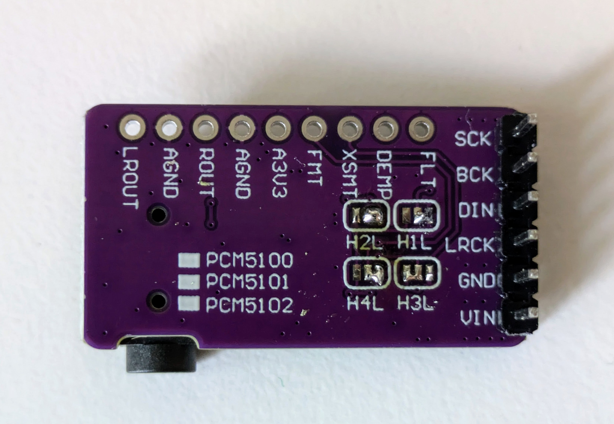
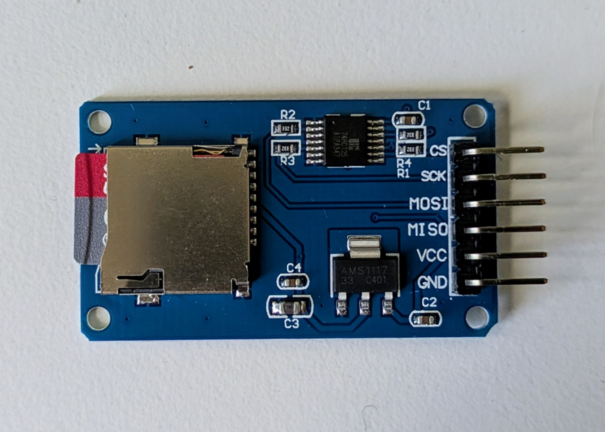

[](https://ko-fi.com/X8X6RXV10)

# Pico Audio Player

 

This is a simple audio file player based on the Raspberry Pi Pico boards. 

## Features

- Plays uncompressed audio files (44.1khz 16 bit WAV files, but more coming) from an SD card
- Can be used with cheap high quality DAC
- Based on [Arduino Audio Tools](https://github.com/pschatzmann/arduino-audio-tools) and Platformio, so you can easily fork this project and use it for another audio project. 
- The onboard BOOTSEL button works as a NEXT-button to go to the next audio file in the player.

*Note:* To make this run smoothly, the Pico 1 is overclocked to 270mhz. Do this at your own risk. 

## Electronics

To make this project, you need:

- An SD card reader module
- A DAC module
- A Raspberry Pi Pico board

These components cost less than 10€ in total usually.

### The DAC

I use a PCM5102A i2s DAC board from Ali Express / Ebay / wherever for this. 

Note, if you are using the same, please make sure the jumpers on the back are soldered like this, otherwise it will be muted by default:

 


#### Pin connections

| PCM5102A Pin | Pico PIN     | Notes                   |
| ----------- | ------------ | ----------------------- |
| SCK         | GND          |                         |
| DIN         | GPIO28       |                         |
| LCK         | GPIO27       |                         |
| BCK         | GPIO26       |                         |
| GND         | GND          |                         |
| VIN         | 3V3          |                         |

### SD Card reader

I use this simple and cheap SD card reader from Ali Express / EBay / wherever:

 

#### Pin connections

Please make sure your sd card reader module's power requirements. Some only take 3.3v, others only 5v. Adjust accordingly:

| SD card pin | Pico pin                                                                        |
| ----------- | ------------------------------------------------------------------------------- |
| MISO        | GPIO16                                                                          |
| MOSI        | GPIO19                                                                          |
| CS          | GPIO17                                                                          |
| SCK         | GPIO18                                                                          |
| VCC         | VBUS (unless your SD card module is a 3V one, then connect it to 3V3(OUT)) |

### Notes about the SD card

The SD card should be formatted as FAT32. Don't use low quality / off brand SD cards. You'll be sorry if you do.

Audio files should be in the format 44.1khz sample rate / 16 bit.

## Compiling

This project is built with Platformio. With a Raspberry Pi Pico connected to your computer, you can compile and upload the firmware in one go from the command line by running this from the root of this project:

```bash
pio run -t upload
```
